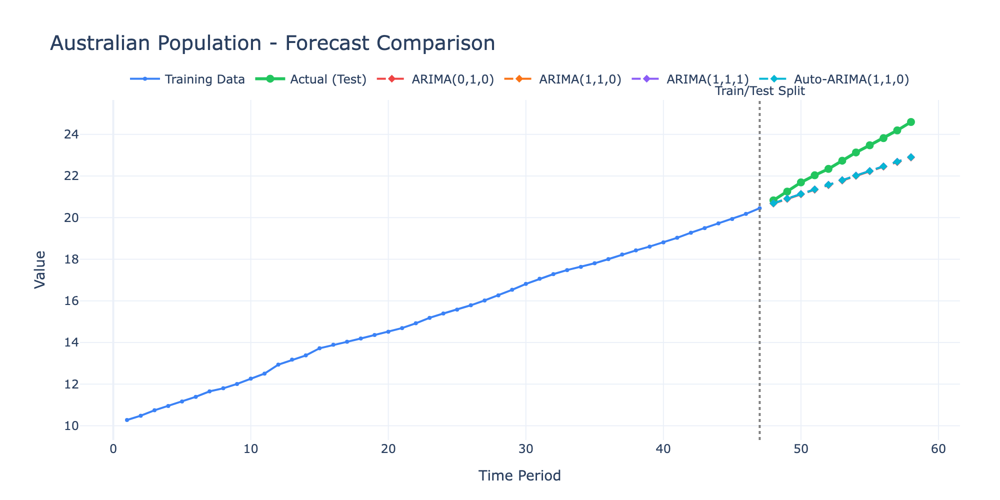
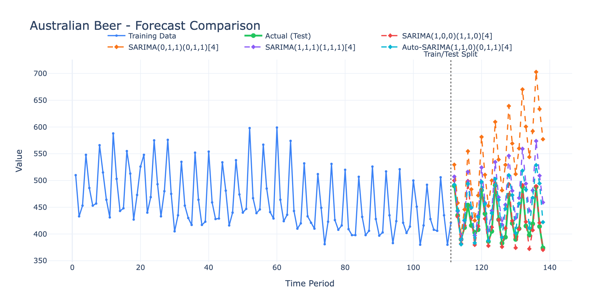
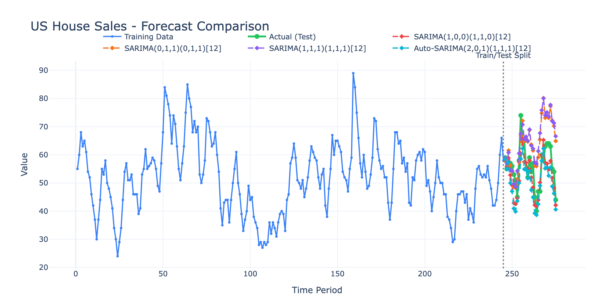
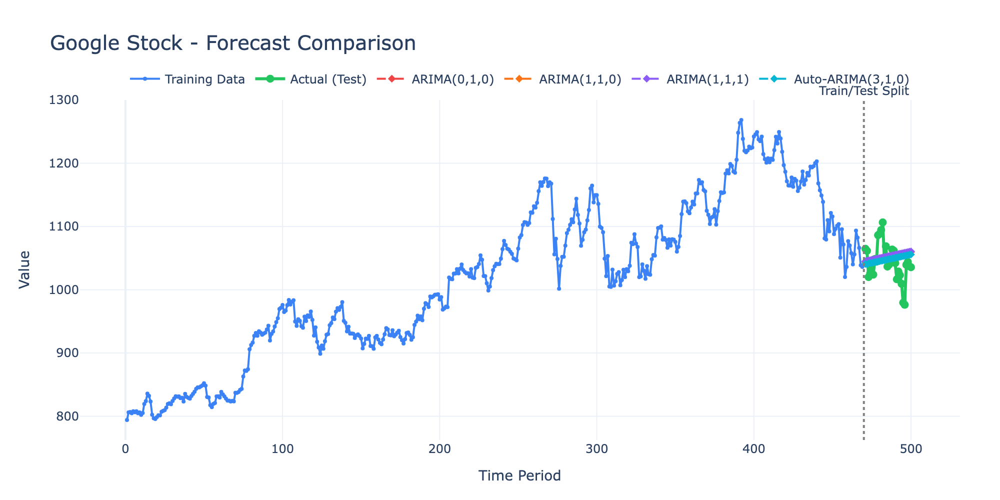

# GoARIMA Demo

This demo showcases ARIMA, SARIMA, and Auto-ARIMA time series forecasting using the GoARIMA library. It analyzes 10 real-world datasets and generates interactive visualizations.

## Screenshots

### Australian Population (Non-seasonal ARIMA)


Annual population data demonstrating non-seasonal ARIMA models. Auto-ARIMA automatically selects the best model order based on AICc criterion.

### Australian Beer Production (Seasonal SARIMA)


Quarterly beer production with clear seasonal patterns. SARIMA models capture both trend and seasonality.

### US House Sales (Monthly Seasonal)


Monthly new house sales data with strong seasonal component (period=12).

### Google Stock Price (Non-seasonal)


Daily closing prices demonstrating ARIMA on financial time series data.

## Features Demonstrated

- **Stationarity Testing**: ADF and KPSS tests with automatic differencing recommendations
- **Model Selection**: Auto-ARIMA with grid search over (p,d,q) and seasonal (P,D,Q,m) parameters
- **ACF/PACF Analysis**: Automatic order suggestion based on autocorrelation patterns
- **Model Comparison**: Multiple models evaluated with AIC, AICc, BIC, RMSE, MAE, MAPE metrics
- **Residual Diagnostics**: Visual analysis of model residuals

## Datasets

| # | Dataset | Type | Period | Description |
|---|---------|------|--------|-------------|
| 1 | Australian Population | ARIMA | - | Annual population (millions) |
| 2 | Australian Cement | SARIMA | 4 | Quarterly cement production |
| 3 | Australian Beer | SARIMA | 4 | Quarterly beer production |
| 4 | Australian Electricity | SARIMA | 4 | Quarterly electricity production |
| 5 | Australian Gas | SARIMA | 4 | Quarterly gas production |
| 6 | US Eggs | ARIMA | - | Annual eggs per capita |
| 7 | US House Sales | SARIMA | 12 | Monthly new house sales |
| 8 | US Strikes | ARIMA | - | Annual strikes count |
| 9 | US Employment | SARIMA | 12 | Monthly private employment |
| 10 | Google Stock | ARIMA | - | Daily closing price |

## Running the Demo

### Prerequisites

- Go 1.21+
- Python 3.8+ (for visualization)

### Step 1: Run the Go Analysis

```bash
cd demo
go run .
```

This will:
- Load and analyze all 10 datasets
- Fit ARIMA/SARIMA models with various orders
- Run Auto-ARIMA to find optimal parameters
- Export results to `forecast_results.json`

### Step 2: Generate Visualizations

```bash
# Install Python dependencies
pip install -r requirements.txt

# Generate interactive HTML charts
python visualize.py

# Open a chart in your browser
open charts/1_australian_population.html
```

### Step 3 (Optional): Export Static Images

```bash
# Generate HTML + PNG images (requires kaleido)
python visualize.py --png

# Or generate PNG images only
python visualize.py --png-only
```

## Output Files

- `forecast_results.json` - Raw analysis results in JSON format
- `charts/*.html` - Interactive Plotly charts (one per dataset)
- `images/*.png` - Static PNG images for documentation

## Sample Output

```
================================================================================
GoARIMA Demonstration - ARIMA/SARIMA/Auto-ARIMA
Reference: https://otexts.com/fpppy/nbs/09-arima.html
================================================================================

================================================================================
[1/10] Australian Population
================================================================================
   Loaded 58 observations (10.28 to 24.59)
   Train: 47, Test: 11
   Fitting ARIMA models...
   ARIMA(0,1,0): RMSE=1.0655
   ARIMA(1,1,0): RMSE=1.0486
   ARIMA(1,1,1): RMSE=1.0433
   Auto-ARIMA(1,1,0): RMSE=1.0486 (11 models, ACF/PACF suggested: (0,1,0))
```

## Reference

Based on [Forecasting: Principles and Practice](https://otexts.com/fpppy/nbs/09-arima.html) by Rob J Hyndman and George Athanasopoulos.
